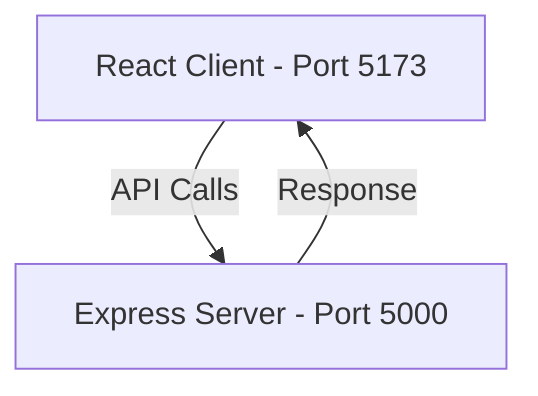

# CraveCart Project Bible

This document serves as the single source of truth for the **CraveCart** application's technical architecture, file system conventions, styling standards, and development guidelines.

---

## 1. Architectural Overview

CraveCart is structured as a monorepo containing a frontend client and a backend API server.



---

## 2. Directory Layout & Conventions

The workspace maintains a strict directory structure. Do not introduce root folders or deviate from these structures without updating this guide.

### 2.1 Client Directory Structure
* **`assets/`**: Direct static assets (icons, illustrations).
* **`components/`**: Presentation UI components. Group generic elements (buttons, inputs) in `ui/` and page-specific elements in dedicated subfolders (e.g. `components/home/`).
* **`constants/`**: Holds Immutable enums, system configurations, and lookup tables.
* **`data/`**: Static JSON data or client mocks.
* **`hooks/`**: Custom reusable React hooks.
* **`layouts/`**: Page wrapper frames containing common header, sidebar, or footer views.
* **`pages/`**: Main entry screens for routes. Keep styling and UI layout separate from complex page logic where possible.
* **`routes/`**: Main AppRouter configuration using React Router DOM.
* **`services/`**: API adapters, clients (e.g. Axios instances), or endpoints wrapper logic.
* **`store/`**: Application state containers (Zustand, React Context).
* **`styles/`**: Global styles containing Tailwind imports and resets.
* **`utils/`**: Helper methods, date formatters, and calculation libraries.

### 2.2 Server Directory Structure
* **`config/`**: Central configuration (e.g., db connects, external API integrations, env readers).
* **`controllers/`**: Logic layer mapping HTTP request payloads to responses.
* **`middleware/`**: Request interceptors (auth verification, logging, schema validation, error handlers).
* **`routes/`**: Express route declarations routing to specific controllers.
* **`app.js`**: Express instance creator mapping middlewares and routing structures.
* **`index.js`**: Low-level runtime bootstrapper starting port listners.

---

## 3. Technology Stack & Configuration

### 3.1 Frontend Configuration
* **React 18:** Functional components with React hooks.
* **Vite:** High performance ESM builder.
* **Tailwind CSS v4:** Modern CSS-first styling.
  * **Imports:** Configured via `@import "tailwindcss";` in `client/src/styles/global.css`.
  * **Path Aliases:** Vite resolves `@/*` to `client/src/*` for short, readable imports:
    ```javascript
    import Button from '@/components/ui/Button';
    ```
* **React Router v6:** Declared declaratively inside `client/src/routes/index.jsx`.

### 3.2 Backend Configuration
* **Express & Node.js:** High speed router layer running on top of Node.
* **ES Modules (`"type": "module"`):** Modern ECMAScript import/export syntax for unified monorepo style.
* **Nodemon:** File watcher for automatic development rebuilds.

---

## 4. Coding Standards & Linter

We enforce code quality using **ESLint** (Flat Config) and formatting consistency using **Prettier**.

### 4.1 Linting Rules
* React JSX validation (warns on unused imports, checks hooks dependencies rules).
* Variables matching `_name` represent unused arguments and do not trigger linter warnings.
* Run checking using: `npm run lint`.

### 4.2 Formatting Rules
* Standard tab width: 2 spaces.
* Single quotes for strings.
* Semicolons are required.
* Print width boundary: 100 characters.

---

## 5. Shared Foundation Infrastructure

To support development across feature milestones, we maintain a core set of reusable components, constants, and helper utilities.

### 5.1 Shared UI Components
Located in `client/src/components/common/`:
* **`Container`**: Centers and bounds page content layout. By default restricts content width to `max-w-7xl` with responsive padding breakpoints (`px-4 sm:px-6 lg:px-8`).
* **`PageWrapper`**: Automatically manages standard HTML document titles on component mount/update and frames contents inside the `Container` shell.
* **`LoadingPlaceholder`**: Renders standard loader spinners with optional wait copy. Supports standard block layout and `fullPage` flex-centered modes.
* **`EmptyState`**: An error/zero-data component with adjustable icon, title, description, and primary CTA buttons (React Router links or callback functions).

### 5.2 Application Constants
Located in `client/src/constants/`:
* **`ROUTES`** (`routes.js`): Centrally maps router path endpoints (e.g. `ROUTES.HOME`, `ROUTES.RESTAURANTS`) to prevent magic strings in links.
* **`THEME`** (`theme.js`): Houses global interface constants, logo strings, and primary layout sizing boundaries.
* **`APP_CONFIG`** (`app.js`): Hosts configurable environment properties (API endpoint URLs, global support contacts, fallback placeholders).

### 5.3 Utility Helpers
Located in `client/src/utils/index.js`:
* **`cls(...classes)`**: Resolves conditional class strings by filtering truthy values.
* **`formatCurrency(amount)`**: Formats numeric prices into standard Indian Rupee (₹) format.
* **`formatDate(dateString)`**: Standardizes ISO date strings into readable calendar dates (`en-IN` standard).

### 5.4 Local Mock Data
Located in `client/src/data/`:
* **`CATEGORIES`** (`categories.js`): Maps categorical selections for the landing page.
  * Schema:
    * `id`: `string` (Unique category key)
    * `name`: `string` (Display name)
    * `image`: `string` (Food visual placeholder URL)
* **`FEATURED_RESTAURANTS`** (`featuredRestaurants.js`): Lists featured landing-page restaurants.
  * Schema:
    * `id`: `string` (Unique identifier)
    * `name`: `string` (Restaurant name)
    * `image`: `string` (Cover image URL)
    * `cuisine`: `string[]` (List of food categories/cuisines)
    * `rating`: `number` (Average customer star rating)
    * `deliveryTime`: `string` (Estimated delivery window text)
    * `priceCategory`: `string` (Rate scale description: `$` / `$$` / `$$$`)

---

## 6. Future Development Extension Points

* **State Management:** Keep it modular. Store files go inside `client/src/store/`.
* **API Calls:** Wrap fetch logic inside `client/src/services/` rather than spreading requests in pages.
* **Themes:** Utilize Tailwind CSS v4 `@theme` configuration directives inside `client/src/styles/global.css` if Custom Styling is needed.

